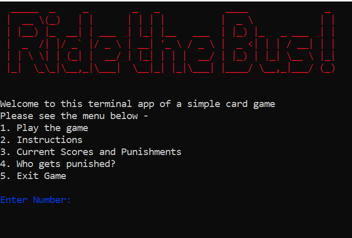
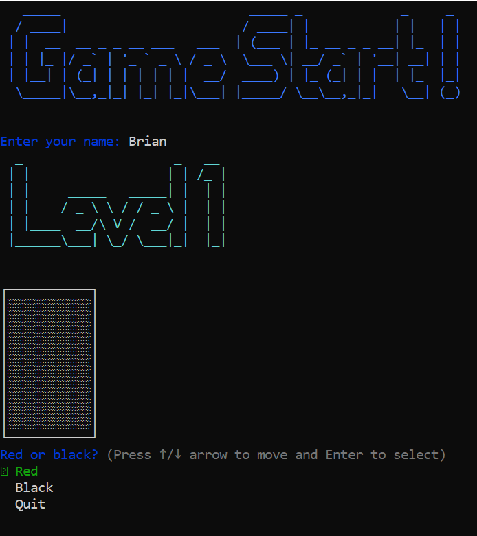
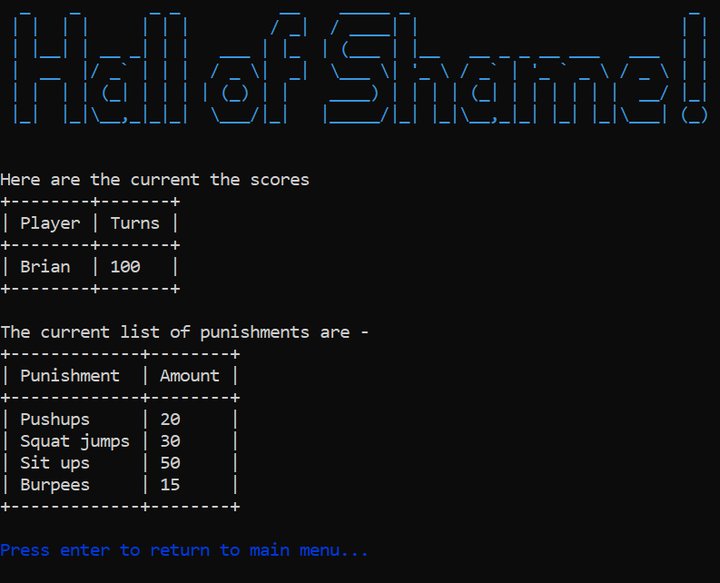
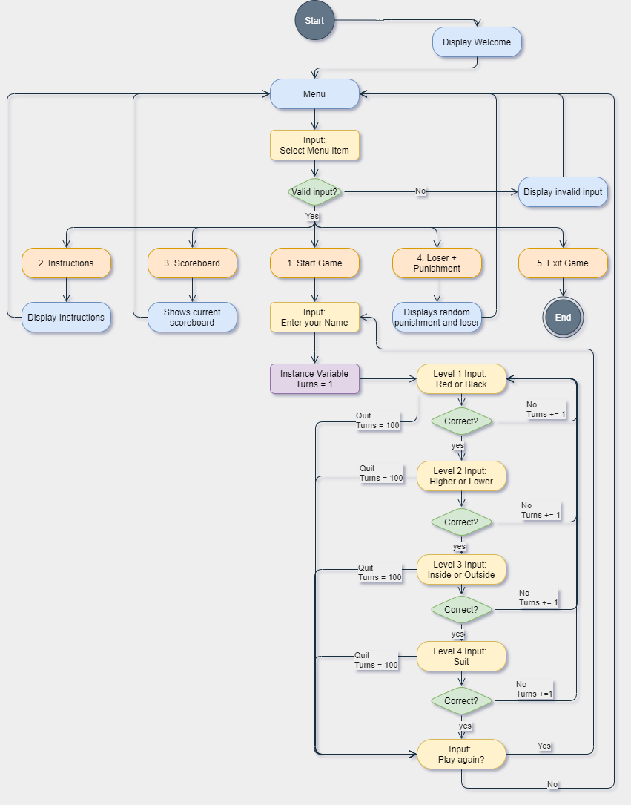
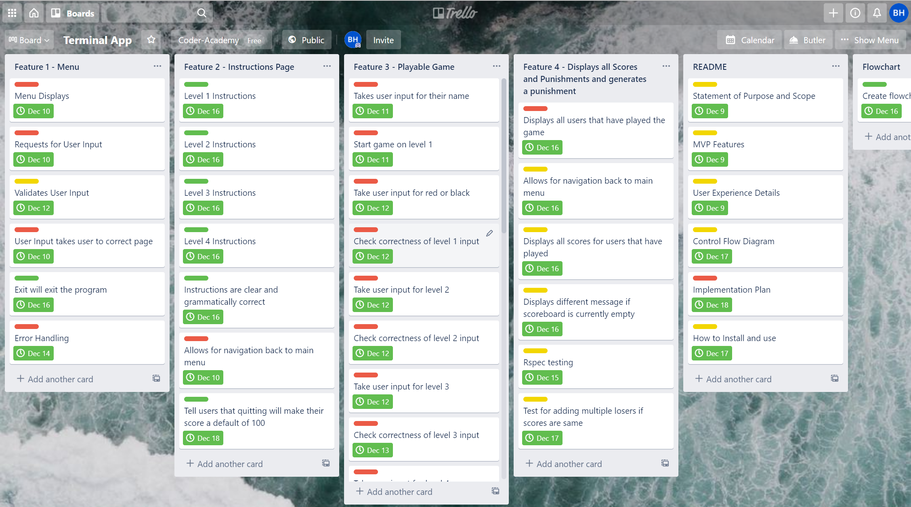
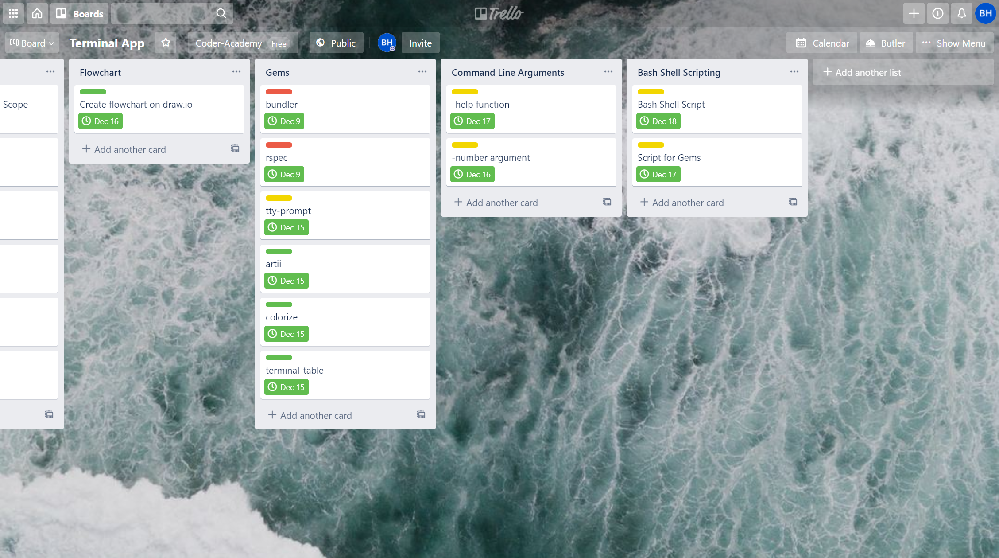

# Ride the Bus Terminal App

## Statement of purpose and scope

### About this application
---

The purpose of this application is provide an entertainment platform between a group of colleagues or friends so that they can play a friendly and simple game. The application consists of a card game whereby random cards are generated from a deck of cards and the player will have to pass through 4 levels to win the game. These levels consist of the following 

#### Level 1
The player will attempt to guess whether the first card dealt will be red or black, with hearts and diamonds being red, and spades and clubs being black.

#### Level 2
Based on the first card dealt, the player will then have to guess whether their second card is higher or lower than their first card.

#### Level 3
Based on the first and second cards, the player will have to guess whether their third card is within or outside their previous two cards. For example, if the first two cards at 2 and 7, the cards 3/4/5/6 would be inside, and the cards would be outside.

##### Level 4
The final level will require the player to guess the suit of their final card (i.e. Spades, Hearts, Diamonds, Clubs)

Once the player has passed all the levels, they will have won the game. However, if the player gets any of the levels wrong, they will have to go back to level 1 and start again, and it will count as having taken one turn.The player who took the highest number of turns to "Ride the Bus" loses the game. The punishments for the loser currently all incorporate fitness based punishments such as pushups, situps and burpees, but these can be ignored and different punishments can be thought of instead.

### Problem and reason for development
---

There are many times when card games want to be played but cards are simply not available or if there is no Internet connection to play any online based multiplayer games. This application will serve as a solution for a group of friends to play a simple card game with a scoring system in place. The game incorporates an element of statistical probabilities and also luck, in a way that the player needs to identify the most likely scenario in their game. For example, in level 2, if the first card dealt was a 3 of diamonds, statistically it would be much more likely for the next card to be higher and not lower. 

### Target audience and use
---

The target audience will be friends or colleagues in a group that want to participate in a group activity where everyone can get involved.

A group of friends or colleagues can sit around in a group and take turns at playing Ride the Bus, with observers being just as engrossed as the player themselves. The scoreboard can be displayed through the main menu to show the current standings. While players may pick the most statistically probable option, there are times when the slim probability can still occur, resulting in surprising results and lots of fun.

## Features
---

### Feature 1 - Navigatable Main Menu
---
The first feature when loading the app will be a navigatable menu that will take the user to different parts of the application. These sections 
- Playing the Game
- Viewing Instructions
- Viewing Scoreboard and pool of punishments
- Displaying the loser and punishment
- Exiting the game

Each section will be allocated a number and the user will access the section by inputting the corresponding number. If invalid input has been entered, the application will detect this and request the user to try again. The program is written in such a way that the user will always eventually loop back to the main menu so they can navigate through various sections of the application, and ultimately exit the game through there also. 

### Feature 2 - Unique Playable Game
---
The Ride the Bus card game is designed so that the player will loop through each of the four levels depending on whether they passed the level or not. Each player will have their own unique experience as each time there is a new variable, the local variables at each stage of the loop is set to a new value. This unique experience is also present when the player fails their initial attempt and has to go back to level 1 to try again, whereby their cards will also be different. 

To address error handling, the Ruby gem Tty-prompt was used so that users would be prompted by the program to make their selection on each level. This prompt would be selectable through their keyboard and removes the margin of error that a player may type their selection incorrectly. 

### Feature 3 - Live Scoreboard with Loser Selection
---

The game features a live scoreboard that will update every time a player has finished the game. Firstly each score is set as a local variable that is initially assigned a value of 0. Within the game loop, this score will increase by 1 each time the player has failed to complete the game. Each time a player has inputted their name and completed all four levels cumulatively, their name and score will be added as a new key, value pair into a scoreboard hash. The scoreboard is an instance variable that acts as the hash to store all player and their respective scores in the Game module. 

## User Interaction and Experience
--- 

The application will run with a main menu feature that will allow the user to navigate throughout the application. The application will prompt the user to input a valid number to access the corresponding section of the main menu. To handle errors or invalid input, a validator has been created to make sure the input is valid and will not terminate the application prematurely. If invalid input has been made, it will notify the user and prompt them to input the correct option instead. Ultimately the user can exit the program through the main menu with one of the options displayed on the screem. Each menu item is clearly labelled so that the user will be able to know what they are navigating to. 

The main feature that the users of this application will use is the card game itself. Users will first be prompted to enter their name so that their name and score can be added to the scoreboard. The game will then proceed directly to Level 1 for which the game will prompt the user to select whether they think the first card will be black or red. To minimise errors of incorrect input or through typing, a Ruby Gem tty-prompt has been used so that users can select options directly through their arrow keys and the enter key. This reduces the error of a user making an typing errors when being prompted for inputs at each level. To make it easier for the user to keep track of what stage they are at, the Ruby Gem artii was used to create large customised font to differentiate between each level. Additionally, after each answer made by the user, the application will display whether their guess was correct or incorrect. To make this display more clearly to the users, the Ruby Gem colorize was used to turn incorrect guess displays as red, and correct displays with green. Whenever the user is prompted for a response of selection, the application clearly states what they are being asked to respond.

Finally, the application will have a feature to display the current scoreboard as well as a list of all currently available punishments. This section is accessible through the main menu. If the scoreboard is empty, instead of displaying an error, the game will instead notify the user that the scoreboard is currently empty. To make the scoreboard and list of punishments more easily viewable, the Ruby Gem terminal-table was used to display all of these features in a more legible fashion. When displaying the loser of the game once all users have finished attempting the game, the game will automatically calculate the person with the lowest score and randomly select a punishment for them. The instructions page feature provides a full summary of the rules of the game, and how the game determines who is the loser in further detail.

 
## Control Flow Diagram
--- 

## Implementation Plan
---

The overall implementation plan is to create the main feature of the game as its own module as the main priority. The different components of the game will also be broken down into different priorities and due dates. The subsequent features and different components of those features will also be broken down into different priorities and due dates. This implementation plan will be managed by the project management platform Trello. A screenshot of this implementation plan has been shown below.

As seen in the screenshot above, each feature has been split into its own section, with its individual tasks and requirements listed underneath. For ease of management, the priority of each checklist task has been colour coded, with red being high priority, yellow being medium priority and green being low priority. Based on these colours, each task is given a certain deadline or due date.

## How to Install and Use
---

### Languages Used
---

Ruby

### Command Line Arguments
---

- -help | -h

-Brings up the help message for this application

- -instruction | -i

Brings up the instructions for the application game

- 1

Takes you directly to the game

- 2 

Takes you directly to the instructions of the game

- 3

Takes you directly to the scoreboard and list of current punishments

- 4 

Takes you directly to the Hall of Shame

### Gems
---

- Bundler
- Rspec
- Colorize
- Artii
- Tty-prompt
- Terminal-table

To install all Ruby Gem dependencies, run the below command

` ./install_dependencies.sh`

### To install and Run
---

Github link

[https://github.com/brianqhe/terminal-card-app](https://github.com/brianqhe/terminal-card-app)

To install all Ruby Gem dependencies, run the below command

` ./install_dependencies.sh`

To run the application, run the below command

` ./run_app.sh`
